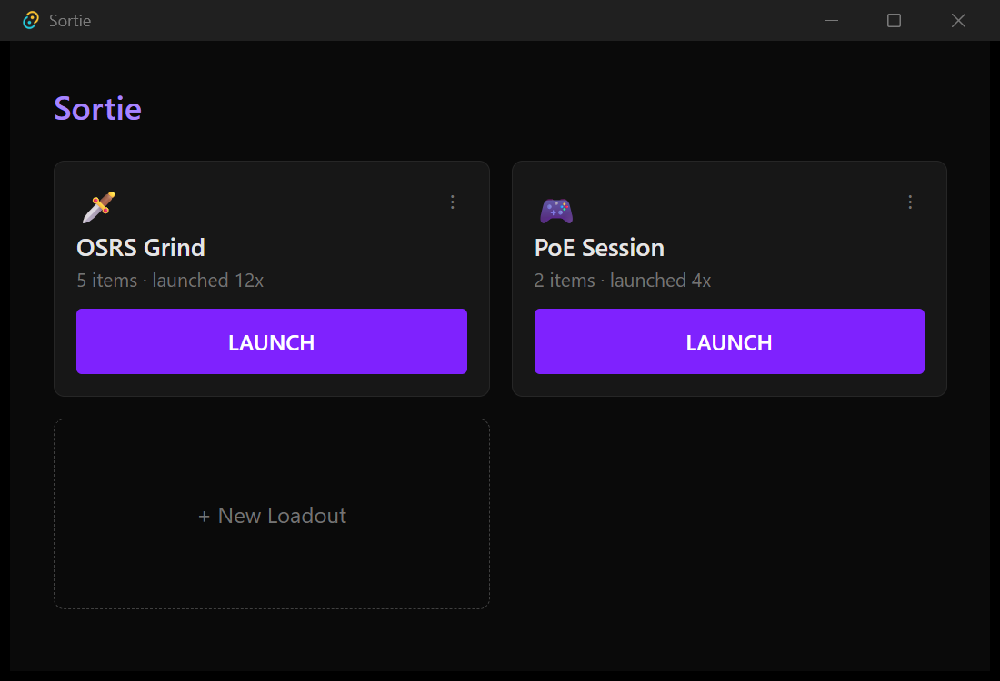
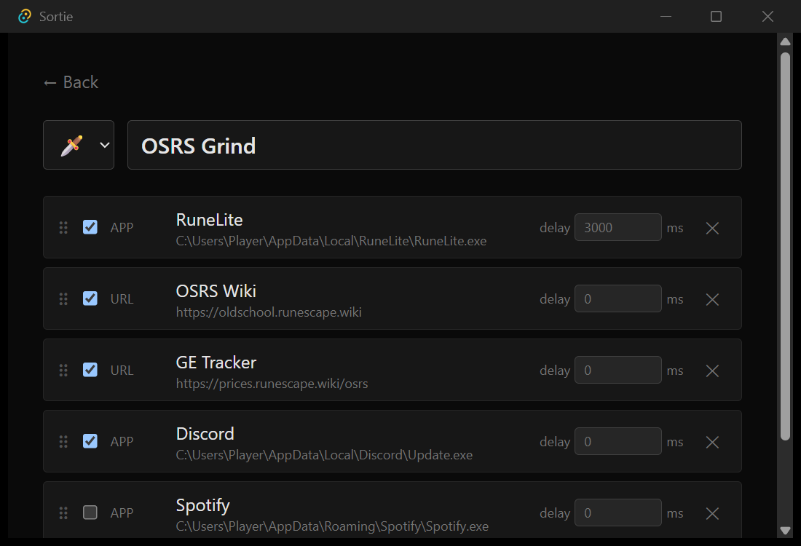
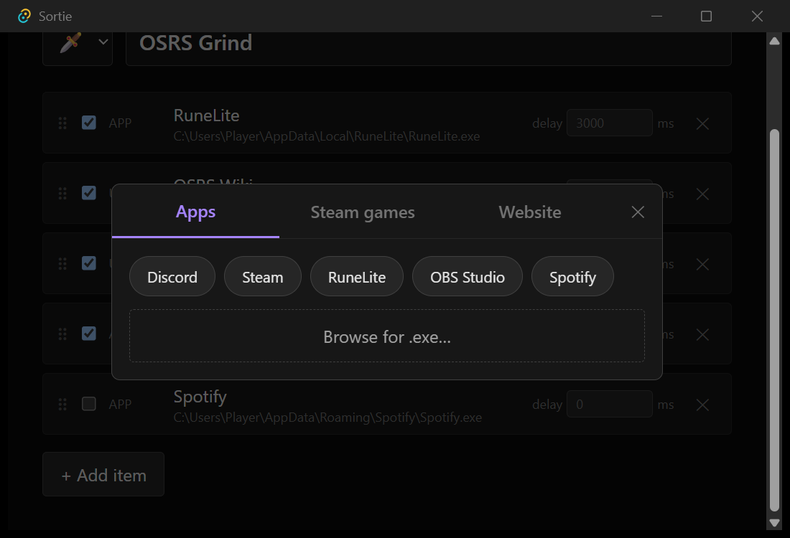
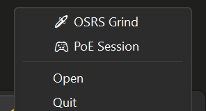

# Sortie

One click launches your entire gaming session — apps, Steam games, and websites, in order. Lives in your system tray.

Windows only. Free.

## Screenshots

**Home** — your loadouts, launch with one click



**Editor** — build a loadout from any mix of apps, Steam games, and websites



**Add item** — detects installed apps automatically, plus your Steam library



**Tray menu** — launch any loadout without opening the window



## Download

Latest release: [github.com/GROBBS-hash/sortie/releases](https://github.com/GROBBS-hash/sortie/releases)

Two options — a Windows installer (per-user, no admin needed) or a portable zip, no install at all.

The build is unsigned, so Windows SmartScreen will warn on first run ("Windows protected your PC"). Click "More info" → "Run anyway." Source is public if you want to check what it does first.

## What it does

- Group any mix of apps (`.exe`), Steam games, and websites into a "loadout"
- Launch a whole loadout in one click — from the app, or right-click the tray icon
- Optional delay between items (e.g. let RuneLite load before opening a wiki tab)
- First run auto-detects common apps (Discord, Steam, RuneLite, OBS, Spotify, etc.) and scans your Steam library, so setup is mostly clicking chips

## What it doesn't do (yet)

- No "close everything" button
- No global hotkeys
- No cloud sync — everything's a local JSON file at `%APPDATA%/Sortie/loadouts.json`

## Building from source

```
npm install
npm run tauri build
```

Requires Node.js, Rust, and the MSVC Build Tools (Windows C++ workload) — see [Tauri's prerequisites guide](https://v2.tauri.app/start/prerequisites/).
